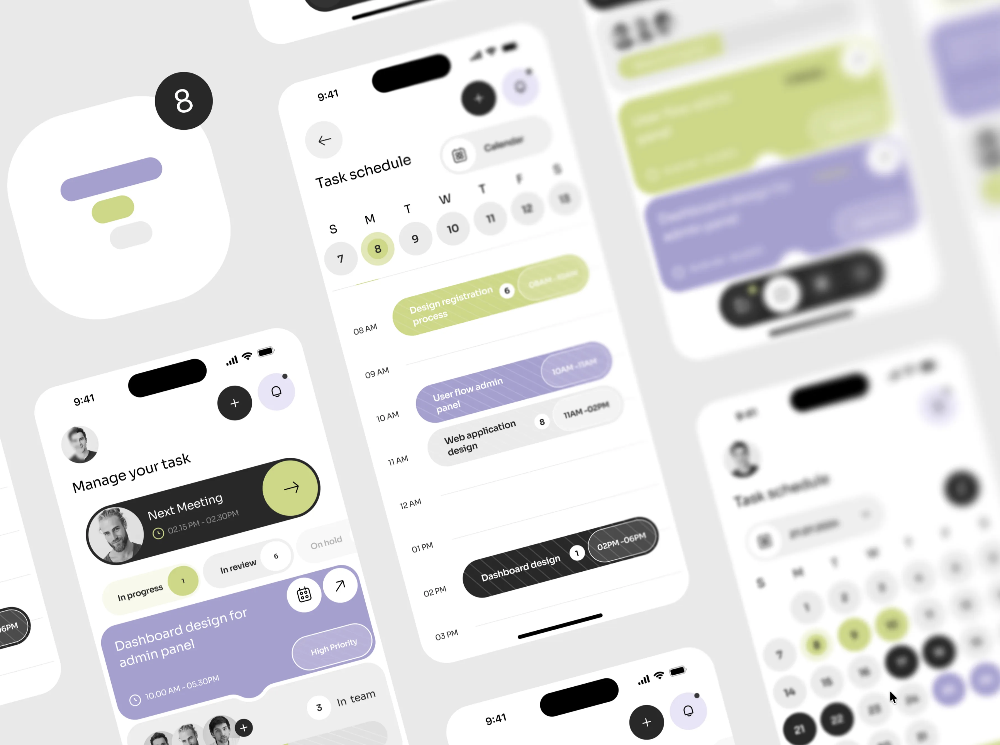
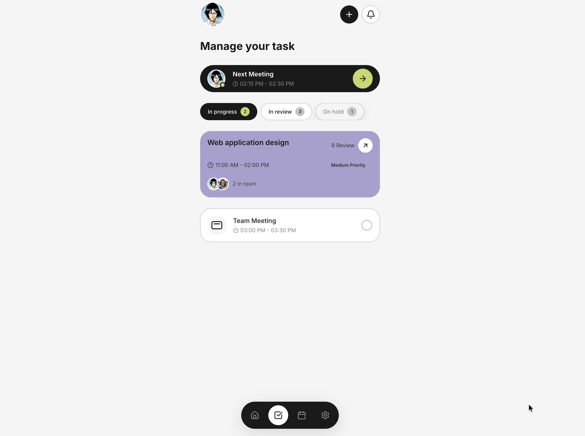
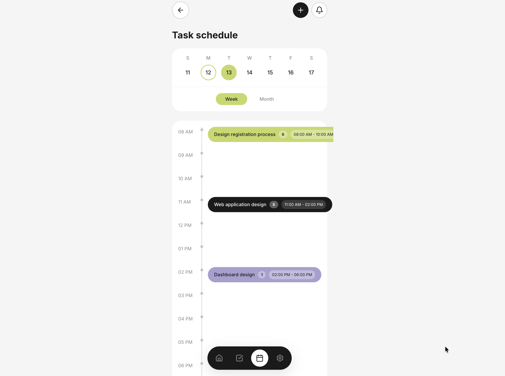
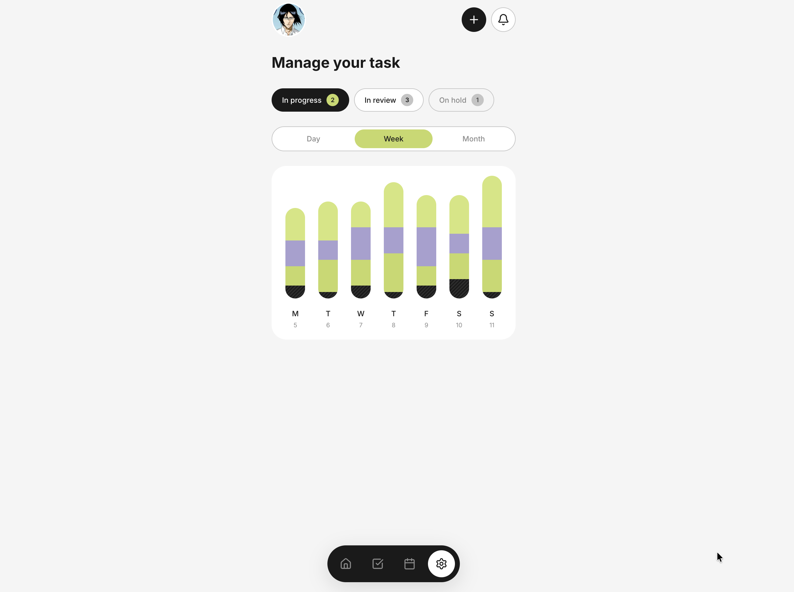
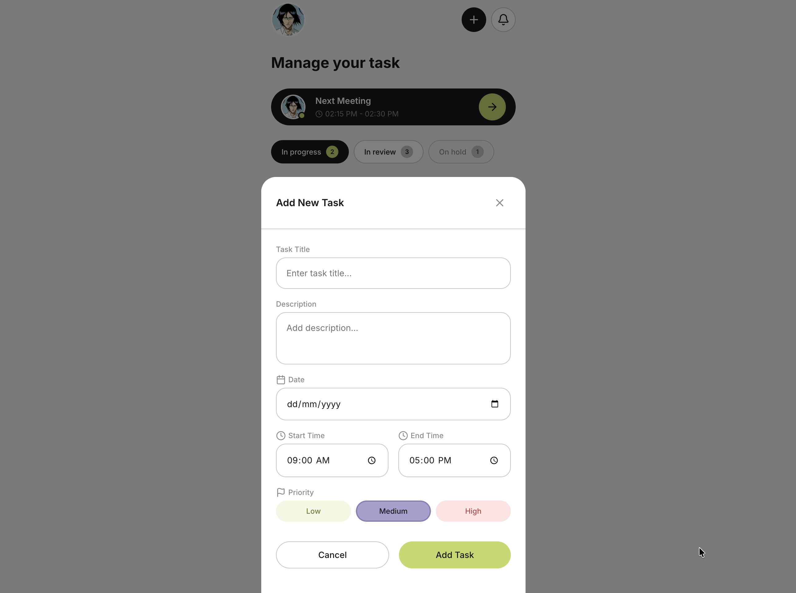
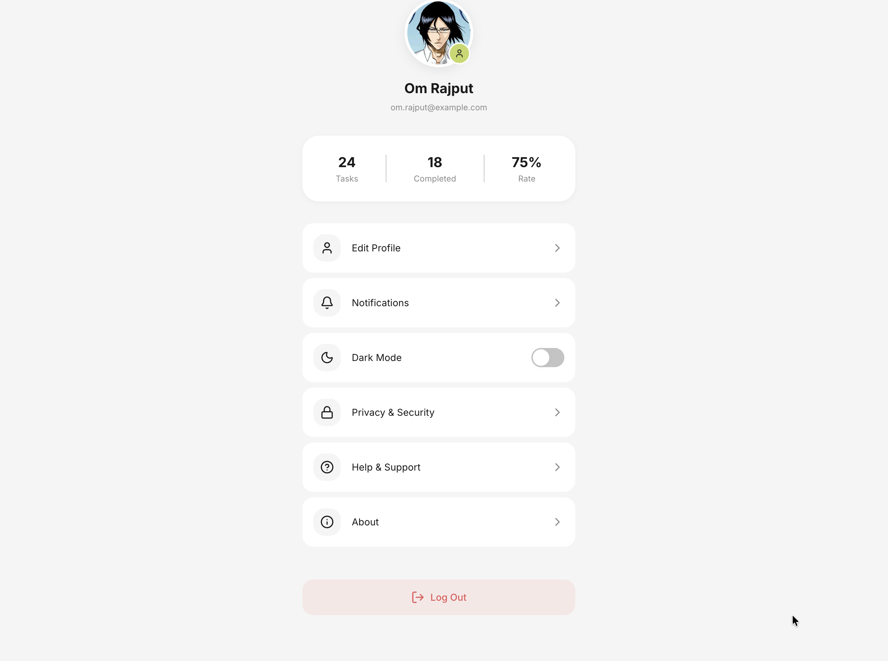
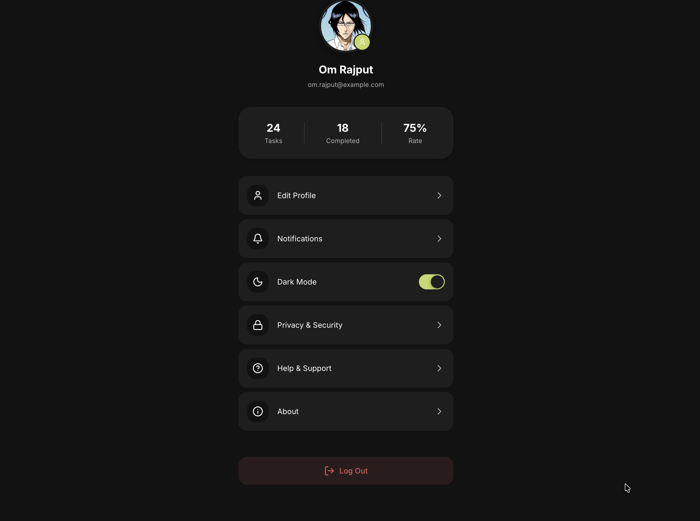
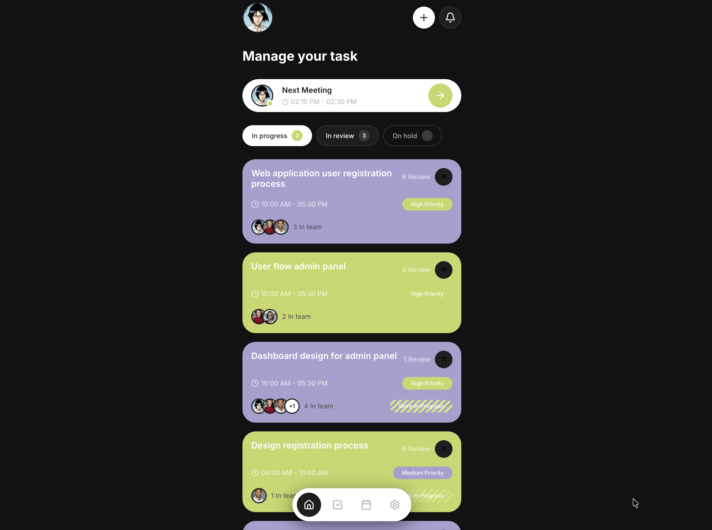

<div align="center">

# ✨ TaskFlow - AI-Powered Task Manager



A premium, modern task management application built with React, TypeScript, and Vite. Features a stunning UI with dark mode support, intelligent task organization, and seamless user experience.

[](https://react.dev)
[](https://typescriptlang.org)
[](https://vitejs.dev)
[](LICENSE)
[](https://github.com/omrajputt369-byte)

[Features](#features) • [Screenshots](#screenshots) • [Installation](#installation) • [Tech Stack](#tech-stack) • [Contributing](#contributing)

</div>

---

## 🚀 Features

- 📋 **Smart Task Management** - Create, organize, and track tasks with ease
- 📅 **Calendar Integration** - Weekly and monthly views with timeline
- 📊 **Analytics Dashboard** - Visualize your productivity trends
- 🌙 **Dark Mode** - Beautiful dark theme with system preference detection
- 👤 **User Profiles** - Personalized experience with stats tracking
- ⚡ **Real-time Updates** - Instant task status changes
- 🎨 **Premium UI** - iOS-inspired design with smooth animations

---

## 📱 Screenshots

### Onboarding

<div align="center">

</div>

*Elegant onboarding experience with floating card animations*

---

### Main Dashboard

<div align="center">

</div>

*Manage your tasks with an intuitive dashboard featuring meeting cards, status filters, and task list*

---

### Key Features

<div align="center">
<table>
<tr>
<td></td>
<td></td>
<td></td>
</tr>
<tr>
<td align="center"><b>Task Schedule</b></td>
<td align="center"><b>Timeline View</b></td>
<td align="center"><b>Analytics</b></td>
</tr>
</table>
</div>

---

### Create New Task

<div align="center">

</div>

*Intuitive task creation with priority selection, date/time pickers, and form validation*

---

### Profile Section

<div align="center">

</div>

*User profile with stats, settings, and personalization options*

---

### Dark Mode

<div align="center">
<table>
<tr>
<td></td>
<td></td>
</tr>
<tr>
<td align="center"><b>Toggle Dark Mode</b></td>
<td align="center"><b>Dark Theme Applied</b></td>
</tr>
</table>
</div>

*Stunning dark mode with smooth theme transitions and persistent preferences*

---

## 🛠️ Installation

```bash
# Clone the repository
git clone https://github.com/omrajputt369-byte/orbit-ai-task-manager.git

# Navigate to project directory
cd orbit-ai-task-manager

# Install dependencies
npm install

# Start development server
npm run dev
```

Open [http://localhost:5173](http://localhost:5173) to view the app.

---

## 🏗️ Tech Stack

| Technology | Purpose |
|------------|---------|
| **React 19** | UI Framework |
| **TypeScript** | Type Safety |
| **Vite** | Build Tool |
| **Lucide React** | Icons |
| **CSS Variables** | Theming |
| **Context API** | State Management |

---

## 📁 Project Structure

```
src/
├── components/          # Reusable UI components
│   ├── AddTaskModal/    # Task creation modal
│   ├── Avatar/          # User avatars
│   ├── Button/          # Buttons & IconButtons
│   ├── Calendar/        # Calendar views
│   ├── TaskCard/        # Task display cards
│   └── ...
├── screens/             # App screens
│   ├── Onboarding/      # Welcome screen
│   ├── Dashboard/       # Main dashboard
│   ├── Schedule/        # Calendar & timeline
│   ├── Analytics/       # Productivity charts
│   └── Profile/         # User settings
├── context/             # React contexts
│   └── ThemeContext/    # Dark mode management
├── styles/              # Global styles
└── types/               # TypeScript types
```

---

## 🎨 Design System

- **Primary Green**: `#C5D865` - Actions, highlights
- **Primary Purple**: `#A8A0D0` - Cards, accents
- **Dark Theme**: `#121212` - Background in dark mode
- **Typography**: Inter font family
- **Border Radius**: 8px - 50px scale

---

## 🤝 Contributing

Contributions are welcome! Please feel free to submit a Pull Request.

1. Fork the project
2. Create your feature branch (`git checkout -b feature/AmazingFeature`)
3. Commit your changes (`git commit -m 'Add some AmazingFeature'`)
4. Push to the branch (`git push origin feature/AmazingFeature`)
5. Open a Pull Request

---

## 📄 License

This project is licensed under the MIT License - see the [LICENSE](LICENSE) file for details.

---

<div align="center">

**Made by [Om Rajput](https://github.com/omrajputt369-byte)**

[](https://github.com/omrajputt369-byte)

⭐ Star this repo if you find it helpful!

</div>
